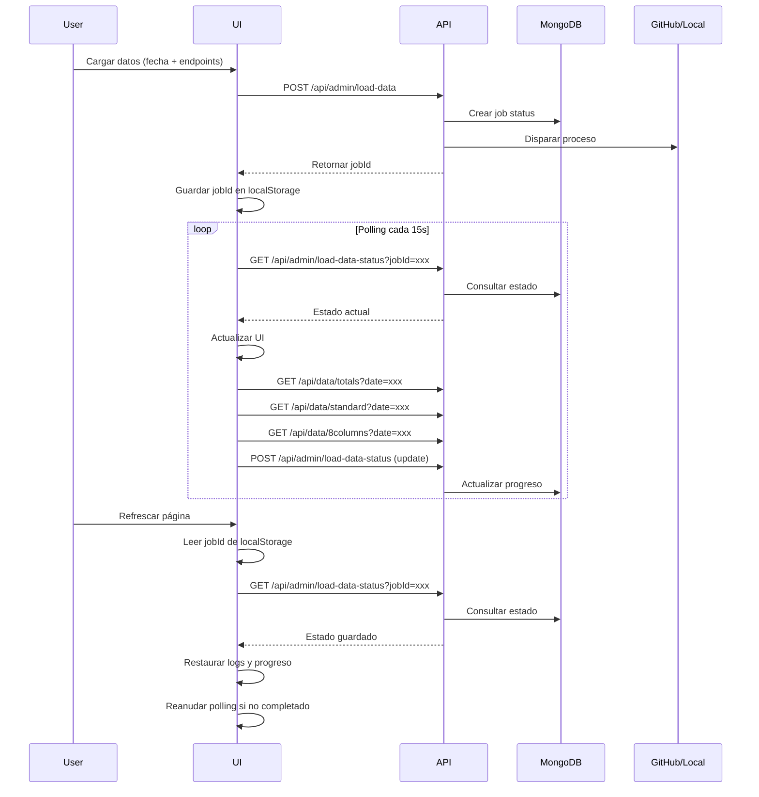

# Sistema de Persistencia de Carga de Datos

## 📋 Descripción General

Sistema de persistencia para el panel de administración de carga de datos que mantiene el estado del proceso de carga incluso al refrescar la página en producción (Vercel).

## 🎯 Problema Resuelto

**Antes:**
- ✅ Local: Persistía usando localStorage + proceso Python en mismo servidor
- ❌ Producción (Vercel): Al refrescar la página se perdía el estado del proceso
- ❌ Vercel es serverless/stateless, no mantiene conexiones entre reloads

**Después:**
- ✅ Local: Persistencia con MongoDB + localStorage
- ✅ Producción: Persistencia con MongoDB (sobrevive reloads)
- ✅ Estado del job se guarda en base de datos

## 🏗️ Arquitectura

### 1. Colección MongoDB: `load_data_status`

```typescript
interface LoadDataJobStatus {
  jobId: string                    // ID único del trabajo
  date: string                      // Fecha de los datos (YYYY-MM-DD)
  endpoints: string[]               // Endpoints a cargar
  status: 'pending' | 'running' | 'completed' | 'failed' | 'timeout'
  mode: 'github-actions' | 'local-execution' | 'local-execution-async'
  startedAt: string                 // Timestamp inicio
  completedAt?: string              // Timestamp finalización
  results: {
    endpoint: string
    status: 'pending' | 'success' | 'error'
    records?: number
    error?: string
    detectedAt?: string
  }[]
  logs: string[]                    // Logs del proceso
  actionUrl?: string                // URL de GitHub Actions
  workflowName?: string             // Nombre del workflow
  error?: string                    // Error si falló
}
```

### 2. API Endpoints

#### `POST /api/admin/load-data`
- Crea un nuevo job de carga
- Genera `jobId` único
- Guarda estado inicial en MongoDB
- Dispara GitHub Actions o proceso local
- Retorna `jobId` al cliente

#### `GET /api/admin/load-data-status?jobId=xxx`
- Obtiene el estado actual del job desde MongoDB
- Usado para recuperar estado al refrescar página

#### `POST /api/admin/load-data-status`
- Actualiza el estado del job (upsert)
- Usado durante polling para actualizar progreso

#### `DELETE /api/admin/load-data-status?jobId=xxx`
- Elimina un job (útil para limpiar jobs antiguos)

### 3. Flujo de Trabajo



## 🔑 Características Clave

### 1. Persistencia Dual
- **localStorage**: Guarda `jobId` y configuración local (fecha, endpoints seleccionados)
- **MongoDB**: Guarda estado completo del job (logs, progreso, resultados)

### 2. Recuperación Automática
Al cargar la página:
1. Lee `jobId` de localStorage
2. Consulta MongoDB para obtener estado completo
3. Restaura logs y progreso
4. Si el job está "running", reanuda polling automáticamente

### 3. Tolerancia a Fallos
- Si MongoDB no está disponible: localStorage mantiene configuración básica
- Si se pierde conexión durante polling: se puede reanudar al refrescar
- Timeout de 10 minutos con notificación al usuario

### 4. Limpieza de Datos
- Botón "Limpiar datos guardados" borra localStorage
- Jobs antiguos (>7 días) se ignoran automáticamente
- Se puede implementar limpieza automática en MongoDB

## 📝 Ejemplo de Uso

### Escenario 1: Carga Normal
```typescript
// 1. Usuario selecciona fecha y endpoints
// 2. Click "Cargar Datos"
// 3. Sistema crea job en MongoDB
// 4. Dispara GitHub Actions
// 5. Polling detecta datos cada 15s
// 6. Al completar: job marcado como "completed"
```

### Escenario 2: Refresh Durante Carga
```typescript
// 1. Usuario inicia carga
// 2. Proceso ejecutándose (polling activo)
// 3. Usuario refresca página (F5)
// 4. Sistema lee jobId de localStorage
// 5. Consulta estado desde MongoDB
// 6. Restaura logs y progreso
// 7. Reanuda polling automáticamente
// 8. Proceso continúa sin interrupciones
```

### Escenario 3: Volver Después de 1 Hora
```typescript
// 1. Usuario inicia carga
// 2. Cierra navegador
// 3. 1 hora después regresa
// 4. Sistema lee jobId de localStorage
// 5. Consulta MongoDB
// 6. Encuentra job "completed"
// 7. Muestra resultados finales
// 8. No reinicia polling
```

## 🛠️ Configuración

### Variables de Entorno
```env
# MongoDB
MONGODB_URI=mongodb+srv://...

# GitHub Actions (opcional)
GITHUB_TOKEN=ghp_...
```

### Índices MongoDB Recomendados
```javascript
db.load_data_status.createIndex({ "jobId": 1 }, { unique: true })
db.load_data_status.createIndex({ "startedAt": -1 })
db.load_data_status.createIndex({ "status": 1 })
```

## 🔍 Debugging

### Ver Jobs Activos
```javascript
// En MongoDB Compass o shell
db.load_data_status.find({ status: { $in: ['pending', 'running'] } })
```

### Limpiar Job Específico
```javascript
// Desde consola del navegador
await fetch('/api/admin/load-data-status?jobId=job_2025-09-23_1234567_abc123', {
  method: 'DELETE'
})
```

### Forzar Completar Job
```javascript
await fetch('/api/admin/load-data-status', {
  method: 'POST',
  headers: { 'Content-Type': 'application/json' },
  body: JSON.stringify({
    jobId: 'job_2025-09-23_1234567_abc123',
    status: 'completed',
    completedAt: new Date().toISOString()
  })
})
```

## 📊 Monitoreo

### Métricas Importantes
- **Jobs completados exitosamente**: `status: 'completed'`
- **Jobs con timeout**: `status: 'timeout'`
- **Jobs con error**: `status: 'failed'`
- **Duración promedio**: `completedAt - startedAt`

### Queries Útiles
```javascript
// Jobs completados hoy
db.load_data_status.find({
  status: 'completed',
  startedAt: { $gte: new Date().toISOString().split('T')[0] }
})

// Jobs que tomaron más de 20 minutos
db.load_data_status.find({
  status: 'completed',
  $expr: {
    $gt: [
      { $subtract: [
        { $toDate: "$completedAt" },
        { $toDate: "$startedAt" }
      ]},
      1200000  // 20 minutos en ms
    ]
  }
})
```

## 🚀 Deployment

### Vercel
1. Variables de entorno configuradas en Vercel Dashboard
2. MongoDB Atlas accesible desde Vercel IPs
3. GitHub Actions configurado con secrets

### Local Development
1. `.env.local` con credenciales
2. MongoDB local o Atlas
3. Python environment configurado

## 📚 Notas Técnicas

- **jobId Format**: `job_{date}_{timestamp}_{random}`
- **Polling Interval**: 15 segundos
- **Max Polling Duration**: 10 minutos (40 iteraciones)
- **localStorage Key**: `laudus-load-data-state`
- **MongoDB Collection**: `load_data_status`

## 🔄 Mantenimiento

### Limpieza Automática (TODO)
Implementar cron job para eliminar jobs antiguos:
```javascript
// Eliminar jobs completados hace más de 30 días
db.load_data_status.deleteMany({
  status: { $in: ['completed', 'failed', 'timeout'] },
  completedAt: { $lt: new Date(Date.now() - 30 * 24 * 60 * 60 * 1000) }
})
```

## ✅ Testing

### Test Manual
1. Iniciar carga de datos
2. Verificar que se crea job en MongoDB
3. Refrescar página durante polling
4. Verificar que se restaura estado
5. Esperar a completar
6. Verificar job marcado como "completed"

### Test de Recuperación
1. Iniciar carga
2. Cerrar navegador completamente
3. Abrir nueva ventana
4. Verificar que proceso continúa
